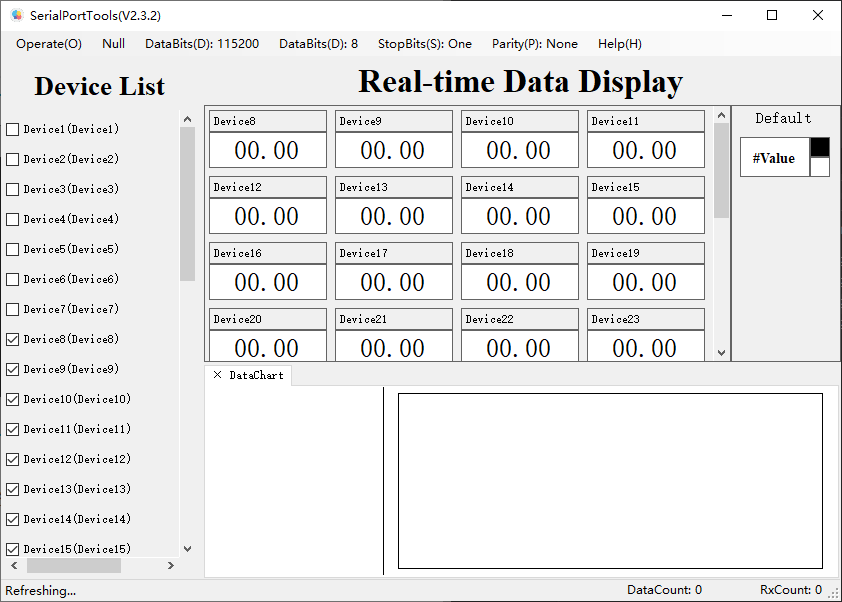

# 串口发送图像

通过自定义串口通信协议实现串口监控多个数据的状态吗, 并绘制出指定的曲线图

`开发平台`: VS2019

`开发技术`: C#, WinForm

`使用到的技术`: SerialPort, Winform

---



串口通信协议为

```txt
设置指令, 用于第一次连接时通知上位机会传递多少数据
#SET;VAR_1;Var_2;Var_3

传递数据, 以分号分隔, ASCII编码字符串内容
#DTU;123;45.6;78
```

*需要注意的是数据曲线图显示可能会导致软件卡顿或崩溃, 该处的程序没有优化*


## 其他

1. 本软件于2017年9月左右编写, 2019年才编写README, 很多地方介绍不是很详细
2. 如果有任何疑问欢迎下载源码讨论
3. 有其他疑问也可联系[作者](maileto:zzudongxiang@163.com)